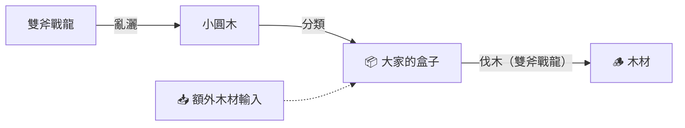
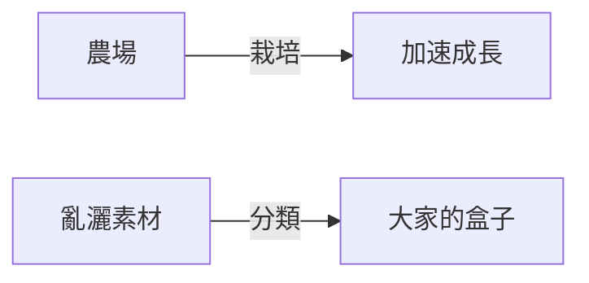
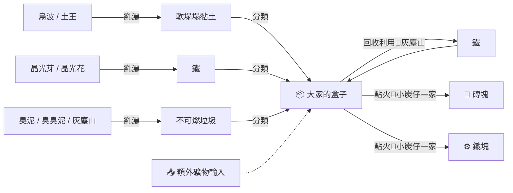

# Pokémon Pokopia - 島嶼建設規劃

## 地區

---

## 乾巴巴荒野 (草原)

### 生產區

農場：
- 妙蛙種子、妙蛙草、妙蛙花
- 喇叭芽、口呆花、大食花

花田
- 派拉斯、派拉斯特
- 三蜜蜂、蜂女王
- 毛球、摩魯蛾

木材場（求晴區）
- 沙漠仙人掌、夢歌仙人掌
- 牙牙、斧牙龍、雙斧戰龍

求雨區
- 黏黏寶、黏美兒、黏美龍

工人小屋：
- 掘掘兔、龍頭地鼠
- 搬運小匠

拆遷中心(碾壓)
- 大岩蛇、大鋼蛇

火爐：
- 小火龍、火恐龍、噴火龍

### 水域

水上樂園
- 傑尼龜、卡咪龜、水箭龜
- 呆呆獸、呆殼獸、呆呆王
- 鯉魚王
- 無殼海兔、海兔獸

### 住宅

山間小屋
- 波波、比比鳥、大比鳥

博士收藏室
- 蔓藤怪、巨蔓藤
- 飄飄球、隨風球 (玩偶收藏區)

### 娛樂/特殊

昆蟲競技場：
- 凱羅斯
- 赫拉克羅斯
- 飛天螳螂、巨鉗螳螂

格鬥小屋：
- 無畏小子、飛腿郎、快拳郎、戰舞郎

墓地：
- 卡拉卡拉、嘎啦嘎啦

---

## 暗沉沉海邊 (海邊)

### 生產區

農場
- 行走草、臭臭花、霸王花、美麗花
- 蛋蛋、椰蛋樹

發電站
- 皮丘、淺淺丘、雷丘

發電站 (市區住房)
- 小福蛋、吉利蛋、幸福蛋
- 電擊怪、電擊獸、電擊魔獸
- 謎擬Ｑ
- 布撥、布土撥、巴布土撥
- 米立龍

水力發電廠
- 波加曼、波皇子、帝王拿波

火力發電廠
- 火稚雞、力壯雞、火焰雞

線，棉花廠（裁縫店）
- 圓絲蛛、阿利多斯
- 咩利羊、茸茸羊、電龍

棉花廠打工（分類）
- 泡沫栗鼠、奇諾栗鼠

木材店
- 索羅亞、索羅亞克
- 強顎雞母蟲、蟲電寶、鍬農炮蟲

### 海岸

海盜船
- 霹靂電球、頑皮雷彈
- 鬼斯、鬼斯通、耿鬼

海邊營火
- 卡蒂狗、風速狗

風車/燈塔
- 長翅鷗、大嘴鷗

### 住宅

橘色小屋
- 幕下力士、鐵掌力士

### 休閒/特殊

溫泉
- 可達鴨、哥達鴨
- 大蔥鴨

渡假村
- 阿勃梭魯
- 差不多娃娃

畫室
- 圖圖犬

洞窟
- 超音蝠、大嘴蝠、叉字蝠

火箭隊
- 喵喵、貓老大

---

## 凸隆隆山地 (工業)

### 生產區（核心產線）

工業區
- 臭泥、臭臭泥
- 帕底亞烏波、土王
- 破破袋、灰塵山
- 小炭仔、炭車郎、巨炭山
- 燃燒蟲、火神蛾（順便產線）
- 晶光芽、晶光花

水泥廠
- 由基拉、沙基拉、班吉拉
- 小拳石、隆隆石、隆隆岩

炎兔兒家
- 炎兔兒、騰蹴小將、閃焰王牌

鴨嘴寶寶家
- 鴨嘴寶寶、鴨嘴火獸、鴨嘴炎獸

農場/木材場（栽培 + 伐木）
- 木木梟、投羽梟、狙射樹梟

### 住宅

利歐路家
- 利歐路、路卡利歐

商店
- 黑暗鴉、烏鴉頭頭

### 餐飲區

廚房：
- 貪心栗鼠、藏飽栗鼠

麵包店
- 狗汪寶、麵包狗

餐廳：
- 溶食獸、吞食獸

### 休閒/娛樂

胖丁公園：
- 皮寶寶、皮皮、皮可西
- 寶寶丁、胖丁、胖可丁
- 地鼠、三地鼠

健身中心
- 腕力、豪力、怪力
- 鐵骨土人

溫泉
- 蓮葉童子、蓮帽小童、樂天河童
- 煤炭龜

森林區
- 愛哭樹、胡說樹

水邊花園
- 阿柏蛇、阿柏怪

Live-house:
- DJ洛托姆
- 電音嬰、顫弦蠑螈
- 炭小侍、紅蓮鎧騎、蒼炎刃鬼

音樂小屋
- 圓法師、音箱蟀
- 聒噪鳥

### 博物館區

博物館：
- 索財靈、賽富豪

考古博物館：
- 化石翼龍
- 頭蓋龍、戰槌龍
- 盾甲龍、護城龍
- 寶寶暴龍、怪顎龍

---

## 亮晶晶空島 (城市)

### 科技區

科技大樓/遊戲中心（廢料回收）
- 鐵啞鈴、金屬怪、巨金怪
- 小磁怪、三合一磁怪、自爆磁怪
- 多邊獸、多邊獸Ⅱ、多邊獸Ｚ

音樂遊戲中心（科技大樓上/旁）
- 嗡蝠、音波龍

巨鍛匠頭頭的塔
- 小鍛匠、巧鍛匠、巨鍛匠
- 修建老匠

### 生產區

農場：
- 藤藤蛇、青藤蛇、君主蛇
- 新葉喵、蒂蕾喵、魔幻假面喵

產棉花
- 青綿鳥、七夕青鳥

收棉花
- 麒麟奇、奇麒麟

火爐
- 火球鼠、火岩鼠、火暴獸

### 市區住宅

沙奈朵家：
- 拉魯拉絲、奇魯莉安、沙奈朵、艾路雷朵

稚山雀家：
- 稚山雀、藍鴉、鋼鎧鴉

多龍家：
- 多龍梅西亞、多龍奇、多龍巴魯托

電海燕家：
- 電海燕、大電海燕

超音波幼蟲家：
- 超音波幼蟲、沙漠蜻蜓

咚咚鼠家：
- 咚咚鼠

### 休閒/娛樂

遊樂園
- 凱西、勇基拉、胡地
- 魔尼尼、魔牆人偶

瀑布
- 暴鯉龍
- 迷你龍、哈克龍、快龍

神社：
- 六尾、九尾

道場：
- 蚊香蝌蚪、蚊香君、蚊香泳士、蚊香蛙皇
- 呱呱泡蛙、呱頭蛙、甲賀忍蛙

寶可夢大樓前
- 正電拍拍
- 負電拍拍

### 暗區

鬼屋
- 夜骷髏、夜巨人、夜黑魔人

墓園
- 燭光靈、燈火幽靈、水晶燈火靈

商店
- 夢妖、夢妖魔

---

## 空空鎮（未開發）

- 瓦斯彈、雙彈瓦斯
- 電螢蟲、甜甜螢
- 古月鳥
- 小卡比獸、卡比獸
- 大嘴娃
- 冰雪龍、冰雪巨龍
- 伊布、水伊布、雷伊布、火伊布、太陽伊布、月伊布、葉伊布、冰伊布、仙子伊布
- 毽子草、毽子花、毽子棉

---

## 夢島

- 蓋歐卡
- 雷公
- 炎帝
- 水君
- 波爾凱尼恩
- 急凍鳥
- 閃電鳥
- 火焰鳥
- 洛奇亞
- 鳳王
- 超夢
- 夢幻

---

## 關鍵自動化流程

### 🪵 木材生產線

> 🔑 關鍵寶可夢：雙斧戰龍（亂灑 + 伐木）



### 🌾 農場



### ⛏️ 礦物自動化

> 🔑 關鍵寶可夢：小炭仔一家（分類 + 點火）



> 🔑 垃圾線關鍵：灰塵山（亂灑 + 回收利用）

### 🔨 碾壓生產線

> 岩石系寶可夢的碾壓專長，可將樹果與石灰加工

```mermaid
flowchart LR
    subgraph dye["🎨顏料"]        
        direction LR
        BERRY["樹果"] -->|"碾壓"| DYE["顏料"]
    end

    subgraph cement["🏗️水泥"]
        direction LR
        LIME["石灰"] -->|"碾壓"| CEMENT["水泥"]
    end
```

---

## 寶可夢相關資料

[寶可夢列表](index.md)
[寶可夢資料庫](pokopia_pokedex.json)
[遊戲資料](catagory.md)
[寶可夢喜好資訊](favorate.md)
